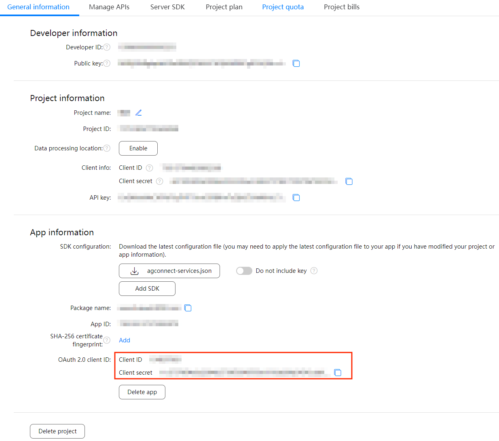

# Huawei push notifications quick start

Newer phones manufactured by [Huawei](https://huaweimobileservices.com/)  come with Huawei Mobile Services (HMS). It's a service used to deliver push _instead of_ Google's Firebase Cloud Messaging (FCM).

> In order to send push notifications, we need to track Huawei token to Exponea servers. So please make sure [tracking](./TRACKING.md) is working before configuring push notifications.

Exponea SDK contains self-check functionality to help you successfully set up push notifications. Self-check will try to track push token, request Exponea backend to send a silent push to the device, and check the app is ready to open push notifications. These checks correspond to steps in this guide.

To enable self-check functionality set `Exponea.checkPushSetup=true` before initializing the SDK

``` kotlin
    Exponea.checkPushSetup = true
    Exponea.init(context, ExponeaConfiguration(...))
```

> **Quick Tip:** We suggest you turn the self-check feature on while implementing the push notifications for the first time or if you need to do some troubleshooting.

## Setting up Huawei services
To send/receive push notifications, you have to:
1. register and set up a [Huawei Developer account](https://developer.huawei.com/consumer/en/console)
2. create a project and App in AppGallery Connect
3. generate and configure a Signing Certificate
4. enable push kit in AppGallery Connect APIs
5. update Gradle scripts and add generated `agconnect-services.json` to your app
6. configure the Signing Information in your app

Steps 2-6 are described in detail in the official [Huawei documentation](https://developer.huawei.com/consumer/en/codelab/HMSPreparation/index.html#0)

## Implement HmsMessageService

Our automatic tracking relies on the implementation of HmsMessageService. Therefore, you will need to create and register a service that extends HmsMessageService.

> **Note:**We decided not to include this implementation in our SDK since we want to keep it as small as possible and avoid including the libraries that are not essential for its functionality. You can copy this code and use it in your app.

1. Create the service
``` kotlin
import android.app.NotificationManager  
import android.content.Context  
import com.exponea.sdk.Exponea  
import com.huawei.hms.push.HmsMessageService  
import com.huawei.hms.push.RemoteMessage

class MyHmsMessagingService: HmsMessageService() {

    private val notificationManager by lazy {
        getSystemService(Context.NOTIFICATION_SERVICE) as NotificationManager
    }

    override fun onMessageReceived(message: RemoteMessage) {
        super.onMessageReceived(message)
        if (!Exponea.handleRemoteMessage(applicationContext, message.dataOfMap, notificationManager)) {
            // push notification is from another push provider
        }
    }

    override fun onNewToken(token: String) {
        super.onNewToken(token)
        Exponea.handleNewHmsToken(applicationContext, token)
    }
}
```

2. Register the service in your AndroidManifest.xml
```xml
<service android:name="MyHmsMessagingService" android:exported="false">  
     <intent-filter> 
         <action android:name="com.huawei.push.action.MESSAGING_EVENT"/>  
     </intent-filter>
</service>  
<meta-data  android:name="push_kit_auto_init_enabled" android:value="true"/>
```
Exponea SDK will only handle push notification messages coming from Exponea servers. You can also use helper method `Exponea.isExponeaPushNotification()`.

If you run the app after completing the setup, the SDK should track push token to Exponea servers. Self-check will tell you that, or you can find your customer in the Exponea web app and check user property `huawei_push_notification_id`

## Configuring Exponea to use your Huawei project 
 You need to connect the Exponea web application to your Huawei project.
   1. Create Huawei Push Service integration in `Data & Assets/Integrations` 
   2. Enter your Huawei project Client ID and Client secret. They can be found at Huawei App Gallery Connect -> Project settings -> App information -> OAuth 2.0 client ID -> Client ID and Client secret. 
   
   3. Open `Project settings` in your Exponea web app
   4. Navigate to `Channels/Push notifications`
   5. Pick your created Huawei Push Service integration

 #### Checklist:
  - If you run the app, self-check should be able to send and receive a silent push notification. 
  
  - you should now be able to send push notifications using the Exponea web app. [Sending Push notifications](./PUSH_SEND.md) guide shows how to send a test push notification.

> **Quick Tip:** It may take a minute for the message service to wake up properly. If sending push fails, try restarting the app. If the issue persists after 2-3 retries, review your setup.

 #### Checklist:
 - send a test push notification from Exponea to the device and tap on it. Your broadcast receiver should be called.

## Great job!
 You should now be able to use Exponea push notifications. You can disable the self-check now or leave it on to check your push setup in every debug build run. 
 
  To further configure push notifications, check the complete documentation for [Configuration](../Documentation/CONFIG.md) and [Push notifications](../Documentation/PUSH.md)
