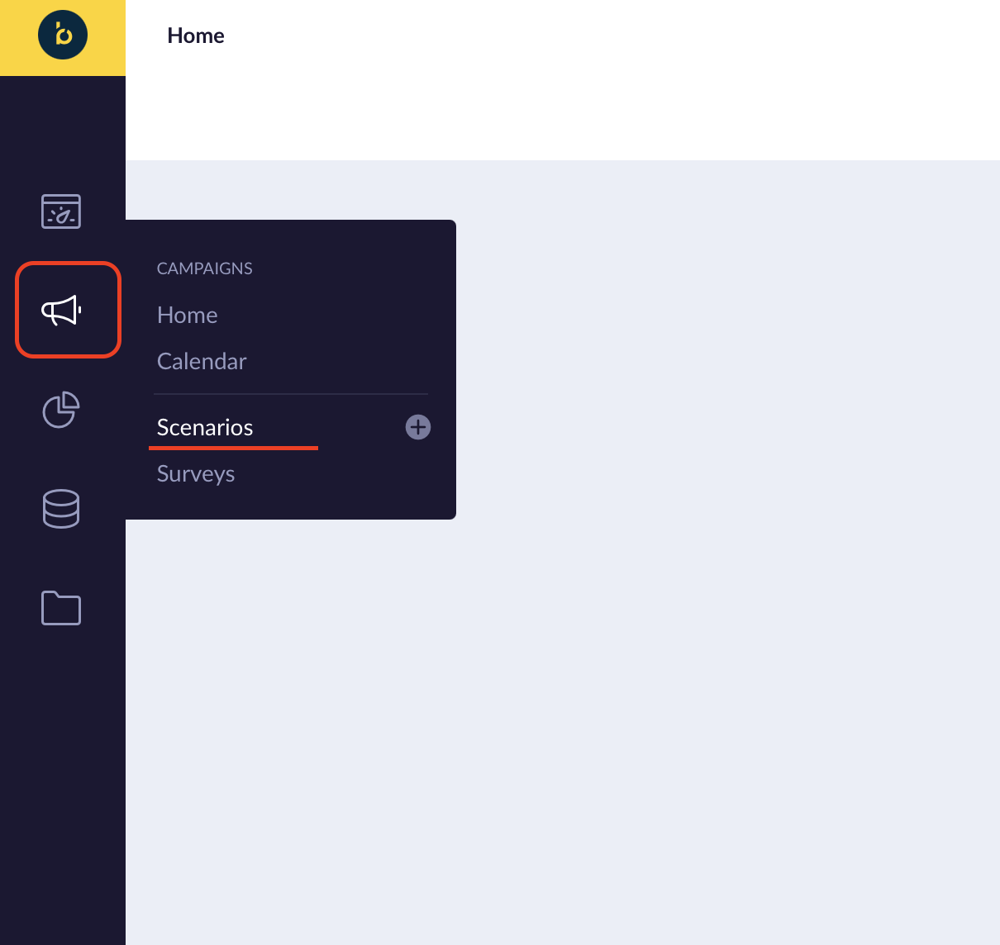
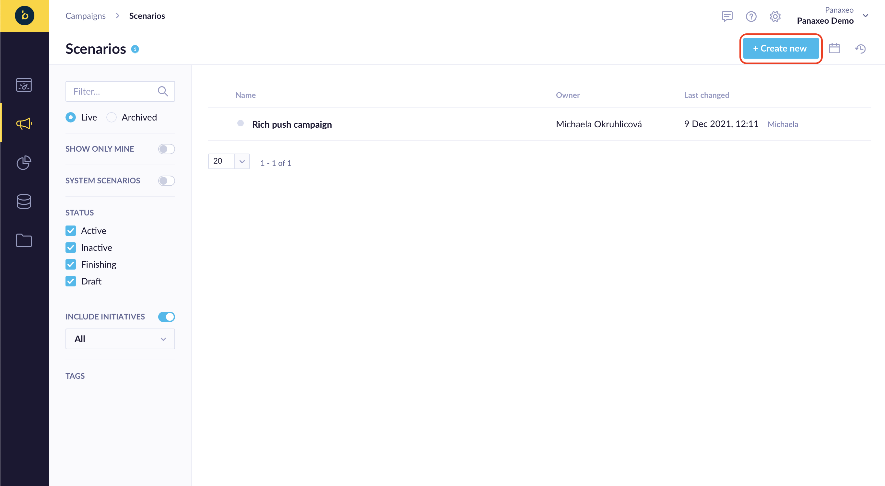
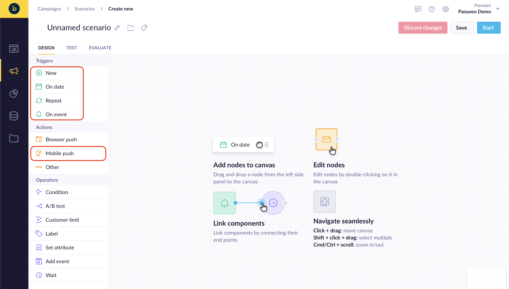

# Sending Push notifications
Exponea web app provides a great notifications builder, where you can customize notification content and interactions. Push notification delivery is run as Campaign delivering push notifications to multiple customers based on conditions you can setup. 

To send a one-off test push notification, you'll need to setup your test user first. Check bottom of this guide for instructions.

## Payload constructing
1. First open Exponea Web App and choose **Campaigns->Scenarios** from the left menu

  

2. To create new Campaign, click on the **Create new** button

  

3. This will open a **Campaign Builder** where you can specify when/how your push notification is triggered
You will need to choose a trigger and action type. If **Mobile Push Notifications** is not visible in actions, add it with opening **Actions->Others** and choose **Mobile Push Notifications** in pop-up menu.

  

  


4. This will open notification builder. There you can specify **Title** (1) and **Message** (2) for your notification. There is a **Preview** (4) on the right side that will show the notification is gonna look like. There is also an option to specify an **Image (6)** you want to display and **Sound (9)** that will be played when notification is received.

> When using SDK version less than 3.0.0, please make sure to provide a sound file name without extension.


5. You can also specify what kind of **Interaction** should happen when the user taps the notification (3). There are 3 options available:
  * Open Application
  * Open Browser
  * Open Deeplink

  

6. Additionally you can specify more **Interactions** by Pressing **Add Action button (8)**


8. Lastly, you can specify additional **Data** you want to send using key-value pairs


## Sending a test push notification
First you'll need to identify your test user with email address. Run the following code in your app:
``` kotlin
Exponea.identifyCustomer(
  CustomerIds(),
  PropertiesList(hashMapOf("email" to "test@test.com"))
)
```

Then select the user by email in the notification builder preview, select Android platform and click **Test push notification** button. The push notification should arrive to your device(emulator) shortly.